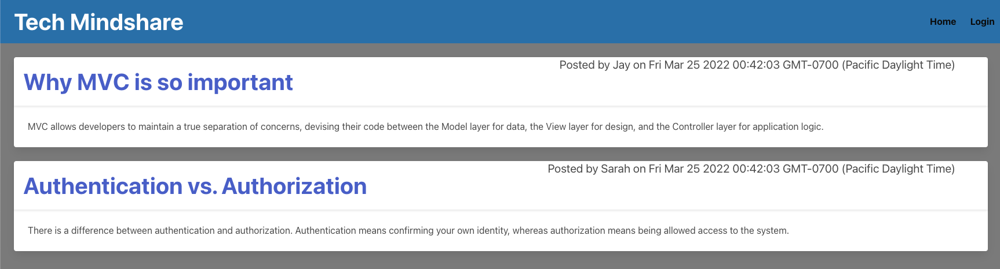

# Tech Mindshare

## Description

This is a site for users who would like to write and post blogs about tech-related topics. Below is a list of the functionality from the perspective of the user:

* WHEN I visit the site for the first time
    * THEN I am presented with the homepage, which includes existing blog posts if any have been posted; navigation links for the homepage and the dashboard; and the option to log in
* WHEN I click on the homepage option
    * THEN I am taken to the homepage
* WHEN I click on any other links in the navigation
    * THEN I am prompted to either sign up or sign in
* WHEN I choose to sign up
    * THEN I am prompted to create a username and password
*  WHEN I click on the sign-up button
    * THEN my user credentials are saved and I am logged into the site
* WHEN I revisit the site at a later time and choose to sign in
    * THEN I am prompted to enter my username and password
* WHEN I am signed in to the site
    * THEN I see navigation links for the homepage, the dashboard, and the option to log out
* WHEN I click on the homepage option in the navigation
    * THEN I am taken to the homepage and presented with existing blog posts that include the post title and the date created
* WHEN I click on the dashboard option in the navigation
    * THEN I am taken to the dashboard
* WHEN I click on the logout option in the navigation
    * THEN I am signed out of the site

## Screenshots of the application

## Technologies used

This application utilizes these technologies:

* Node.js
* The [bcrypt NPM package](https://www.npmjs.com/package/bcrypt)
* The [Connect Session Store using Sequelize NPM package](https://www.npmjs.com/package/connect-session-sequelize)
* The [Dotenv NPM package](https://www.npmjs.com/package/dotenv)
* The [Express.js NPM package](https://www.npmjs.com/package/express)
* The [Express-Handlebars NPM package](https://www.npmjs.com/package/express-handlebars)
* The [Express-Session NPM package](https://www.npmjs.com/package/express-session)
* The [MySQL 2 NPM package](https://www.npmjs.com/package/mysql2)
* The [Sequelize NPM package](https://www.npmjs.com/package/sequelize)
* JavaScript

## Contact information

* Website: https://jaymoses01.github.io/hw-08-updated-portfolio-page/
* Email: JayRMoses@gmail.com

## MIT license

Permission is hereby granted, free of charge, to any person obtaining a copy
of this software and associated documentation files (the "Software"), to deal
in the Software without restriction, including without limitation the rights
to use, copy, modify, merge, publish, distribute, sublicense, and/or sell
copies of the Software, and to permit persons to whom the Software is
furnished to do so, subject to the following conditions:

The above copyright notice and this permission notice shall be included in all
copies or substantial portions of the Software.

THE SOFTWARE IS PROVIDED "AS IS", WITHOUT WARRANTY OF ANY KIND, EXPRESS OR
IMPLIED, INCLUDING BUT NOT LIMITED TO THE WARRANTIES OF MERCHANTABILITY,
FITNESS FOR A PARTICULAR PURPOSE AND NONINFRINGEMENT. IN NO EVENT SHALL THE
AUTHORS OR COPYRIGHT HOLDERS BE LIABLE FOR ANY CLAIM, DAMAGES OR OTHER
LIABILITY, WHETHER IN AN ACTION OF CONTRACT, TORT OR OTHERWISE, ARISING FROM,
OUT OF OR IN CONNECTION WITH THE SOFTWARE OR THE USE OR OTHER DEALINGS IN THE
SOFTWARE.
